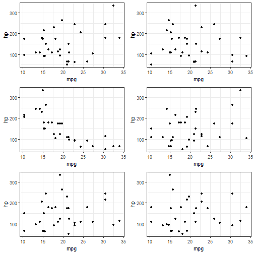
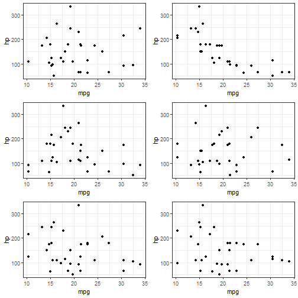

# inferViz

## Origins

At the 2018 RStudio::conf, Di Cook gave a great presentation about inference through visualization. The concept of Few's/Berk's "interoccular traumatic impact" was not new to me, but Di's take was something completely different to me. Interestingly, I remember having done something on mturk related to her presentation; unfortunately, I was not really thinking critically about the meaning of the task at the time.

Shortly after seeing Di's talk, I decided to put something together for the sake of teaching the concept of visual inference to students. 

## Installation

This is not on CRAN, but you can get it here:


```r
if(!(require(devtools))) {install.packages("devtools")}

devtools::install_github("saberry/inferviz")
```


## Use 

The main function, simviz, was created with the intention of being easy for students to immediately start using.


```r
library(inferviz)

simViz(mtcars, mpg, hp)
```


It is conceptually simple -- plot the real visualization, alongside visualizations with variable values randomized. The principles oftidyeval were used, so that students can just pop in data and variable names (some students who are just beginning the long journey seem to get confused by the \$). This eases the burden on getting the function working and produces visualizations without much effort. 


```r
mtcars %>% 
  simViz(., mpg, hp)
```


The number of distractors can be increased or decreased from the default of 3:


```r
simViz(mtcars, mpg, hp, distractors = 5)
```



There is also an "interactive" mode for simviz; by setting the answer argument to TRUE, users can select whether they see the real visualization or not. 


```r
simViz(mtcars, mpg, hp, distractors = 5, answer = TRUE)
```



```
## Are you ready to see the real visual? 
## 
## 1: No
## 2: Yes
```


In addition to visualization, there is also a basic linear model simulator. It behaves very much in the same way as the visualizations, but instead produces a table of coefficients. Students come armed with the knowledge that *p*-values are the ultimate arbiter of truth in science, so this is a way to nudge them towards looking at the coefficients first. My goal is to have students look at the coefficient patterns and see if they make sense given their hypotheses.


```r
simMod(mtcars, mpg, wt, distractors = 5)
```

```
##   (Intercept)        wt
## 1    37.28513 -5.344472
## 2  -0.4484969 0.6266833
## 3    21.53355  18.07443
```

